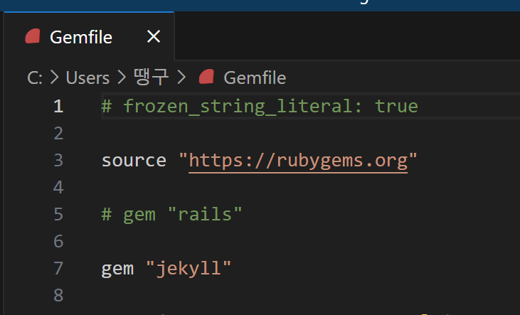

# 블로그를 Github에서 만들어보자
  ### 어쩌다 이걸 골랐나
  게임학원에서 쓰는 TIL(Today I Learned)이 Markdown(확장자명:md)로 쓰인다는 것을 알았다. 간단히 풀어 설명하자면 오늘배운거 일기를 텍스트 파일로 쓰는데, 그게 마크다운 이라는 것이다.  마크다운은 txt 파일처럼 생각 할 수 있는데, 보다 확장된 것이다. 편집기에서 쓰이는 기능들을 코딩하듯이 쓰면 마크다운 포멧에서는 동일하게 보이는 것이다. 또한 강사님께서 Markdown으로 일지를 남기는 게 좋을 것이라 하여, md를 쓰는 블로그가 뭐뭐 있나 찾아보다가 깃허브에서 정적(Static) 웹페이지를 무료로 호스팅 가능한 것을 알았다. 단점도 많기는 하지만 장점도 많다.

  - 무료!
  - 마크다운 호환
  - 매우 높은 자유도 등등

  ### Github에서 무료로 사이트를 만들다

  Github page 에서 사이트를 만들고 호스팅 하기 위해 설치해야 할 것들이 있다. 이번 가이드는 Windows 10 에서 진행했다.

  >- Visual studio code (https://code.visualstudio.com/)
  >- Ruby (https://rubyinstaller.org/)  ruby +devkit 하이라이트 되어 있는걸 받는다.

Ruby 설치창 마지막 즈음에 'ridk install' 을 한다.
 설치가 완료되면 시작 표시줄에서 다음을 실행.
>Start command prompt with Ruby

 콘솔창에 다음을 입력한다.

>gem install jekyll bundler

설치가 좀 오래걸릴 수 있다. 설치가 끝나면 콘솔창에 다음과 같이 입력하면 제대로 설치됐는지 확인할 수 있다.

>jekyll -v

새로 젬파일을 생성한다 콘솔창에 다음과같이 입력. 나는 C드라이브에 했다.
>bundle init

이후 젬파일을 vs code로 열어서 편집한다.

